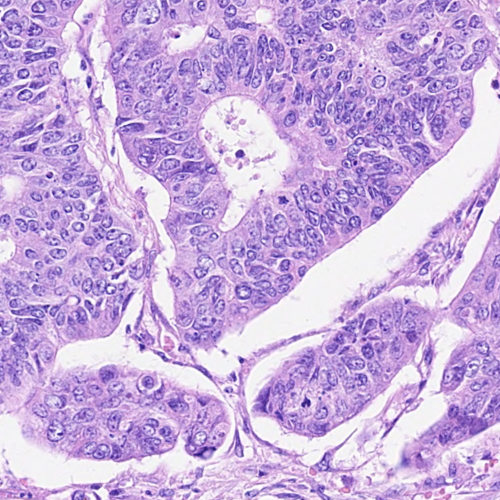
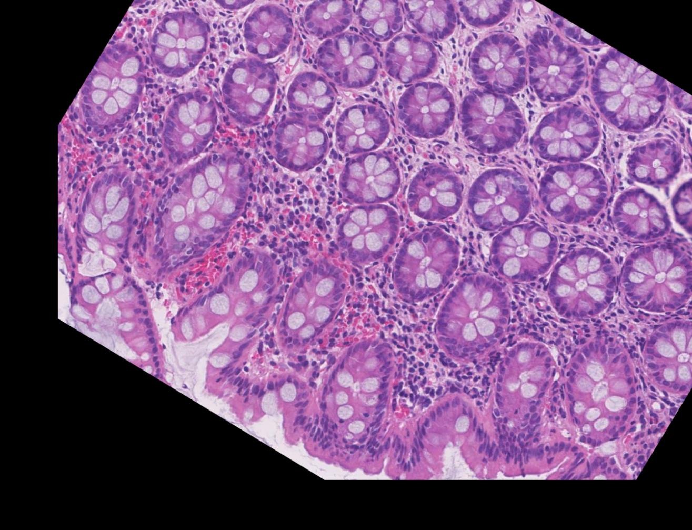
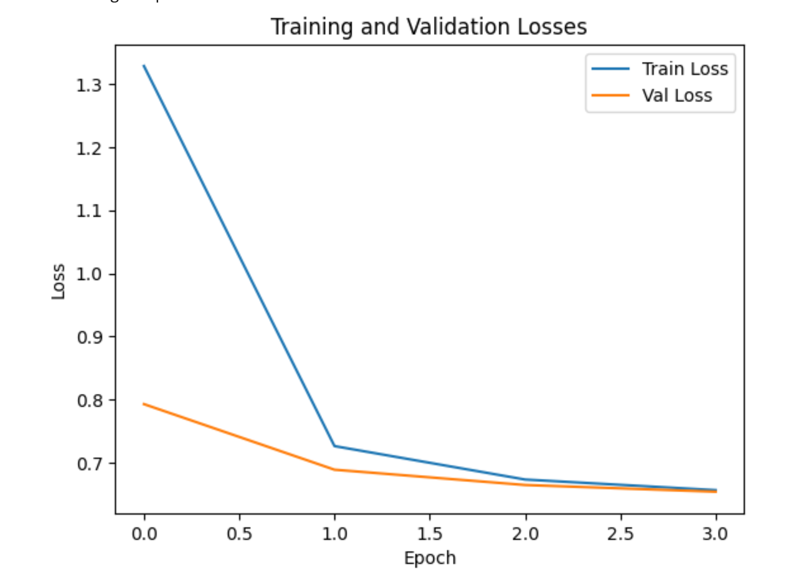
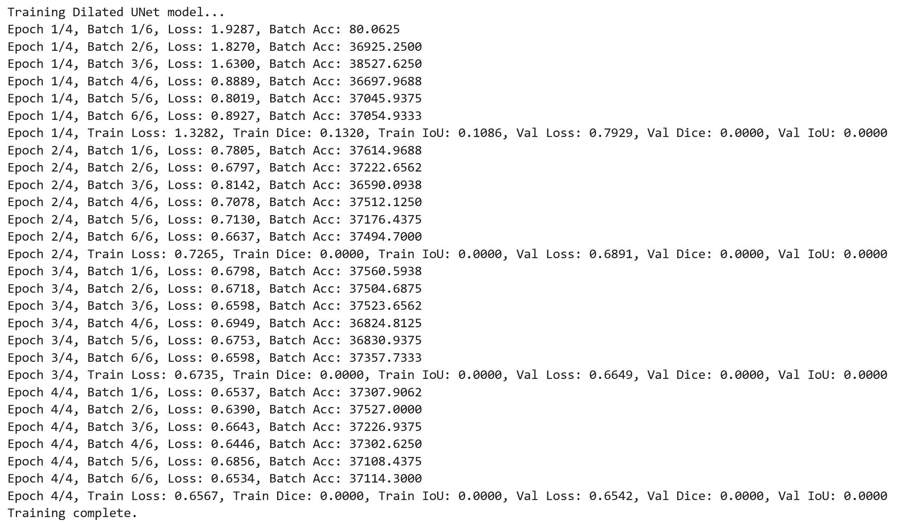
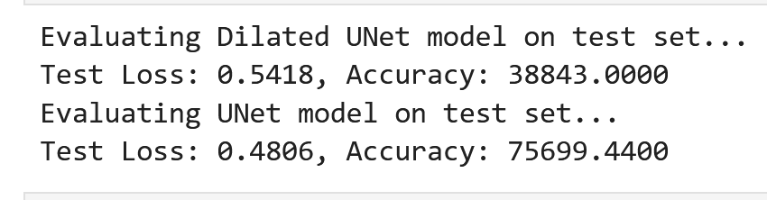

# Neurónové siete - projekt 2

**Autori:** Martin Šváb, Tomáš Ondruš

**Projekt:** DeepLab - Dilated Convolutions

## Analýza dát

**Dataset:** Lizard dataset

Náš dataset obsahuje obrázky reprezentujúce histologické dáta.

Obrázky sú opísané pomocou:

* segmentačná mapa
* trieda
* centroid
* bounding box

V datasete sa nachádza 6 rôznych tried:

* Neutrophil
* Epithelial
* Lymphocyte
* Plasma
* Neutrophil
* Connective tissue

## Augmentácia

Pre zvýšenie počtu trénovacích dát používame nasledujúce augmentačné metódy:

* Priblíženie
* Rotácia
* Translácia

## Trénovanie

V našej práci trénujeme neurónovú sieť na segmentáciu histologických obrázkov. Učíme konvolučnú sieťklasifikovať pixely obrázka ako jednu zo 6 možných tried. Porovnávame výkon 2 rôznych architektúr neurónových sietí.

### UNET

### Dilated UNET

### Validácia

